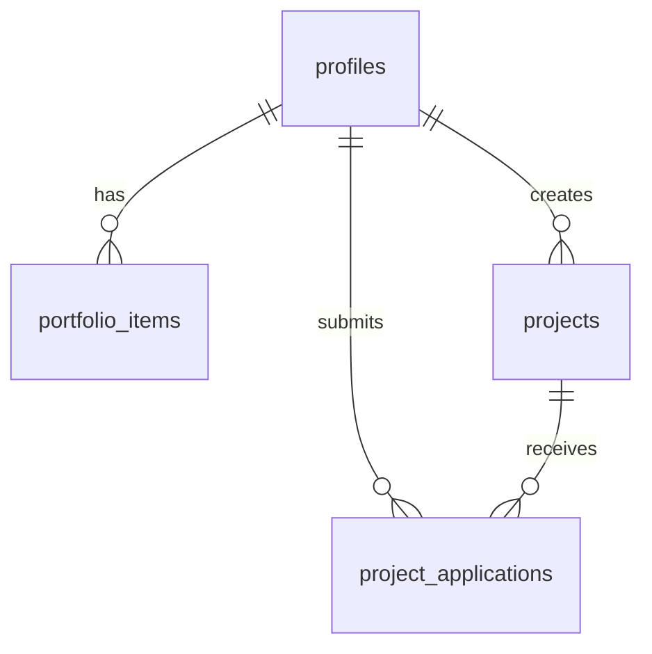

# Krystal Platform V6

## Descripción General

Krystal Platform es una plataforma que conecta talentos (modelos, influencers, actores, fotógrafos, creadores de contenido y artistas digitales) con empresas para proyectos y campañas. La plataforma facilita la gestión de portafolios, aplicaciones a proyectos y comunicación entre las partes.

## Tecnologías Utilizadas

- **Frontend:**

  - Next.js (App Router)
  - TypeScript
  - Tailwind CSS
  - Shadcn/ui (componentes)
  - React Context para estado global

- **Backend:**

  - Supabase (Base de datos y autenticación)
  - PostgreSQL con RLS (Row Level Security)
  - pgvector para búsqueda semántica

- **Inteligencia Artificial:**
  - OpenAI GPT-4 para análisis y sugerencias
  - text-embedding-ada-002 para embeddings
  - CLIP para análisis de imágenes
    Ver más detalles en [docs/ai-models.md](docs/ai-models.md)

## Documentación Adicional

- [Modelos de IA y Embeddings](docs/ai-models.md) - Detalles sobre los modelos de IA utilizados
- [Estructura de Base de Datos](docs/database.md) - Diagrama ER completo y documentación de la base de datos

## Requisitos Previos

- Node.js 18.x o superior
- pnpm (gestor de paquetes)
- PostgreSQL
- Git

## Instalación y Configuración Local

1. Clonar el repositorio:

```bash
git clone [URL_DEL_REPOSITORIO]
cd krystal-platform
```

2. Instalar dependencias:

```bash
pnpm install
```

3. Configurar variables de entorno:
   Crear un archivo `.env.local` en la raíz del proyecto con las siguientes variables:

```env
NEXT_PUBLIC_SUPABASE_URL=your_supabase_url
NEXT_PUBLIC_SUPABASE_ANON_KEY=your_supabase_anon_key
```

4. Iniciar el servidor de desarrollo:

```bash
pnpm dev
```

5. Visitar http://localhost:3000 en el navegador

## Estructura del Proyecto

```
├── app/                    # Rutas y páginas de Next.js
│   ├── business/          # Rutas para usuarios business
│   │   ├── dashboard/
│   │   ├── project/
│   │   └── talent/
│   ├── talent/            # Rutas para usuarios talent
│   │   ├── dashboard/
│   │   ├── portfolio/
│   │   └── profile/
│   └── layout.tsx         # Layout principal
├── components/            # Componentes reutilizables
│   ├── layout/           # Componentes de layout
│   └── ui/               # Componentes de UI
├── contexts/             # Contextos de React
├── hooks/               # Custom hooks
├── lib/                # Utilidades y helpers
├── public/             # Archivos estáticos
├── scripts/            # Scripts SQL y otros
└── styles/            # Estilos globales
```

## Estructura de la Base de Datos

### Diagrama ER

Ver el diagrama completo en [docs/db-diagram.md](docs/db-diagram.md)



### Tablas Principales

1. **profiles**

   - Extiende auth.users
   - Almacena información de usuarios (talent y business)
   - Campos específicos para talentos (métricas sociales, información física)

2. **projects**

   - Proyectos/campañas creados por businesses
   - Estados: draft, active, paused, completed, cancelled

3. **portfolio_items**

   - Trabajos y contenido de los talentos
   - Incluye imágenes, videos y documentos

4. **project_applications**
   - Aplicaciones de talentos a proyectos
   - Estados: pending, accepted, rejected, withdrawn

### Enums

- user_type_enum: talent, business, admin
- talent_category_enum: model, influencer, actor, photographer, content_creator, digital_artist, other
- project_status_enum: draft, active, paused, completed, cancelled
- campaign_type_enum: brand_campaign, product_launch, social_media_campaign, event_coverage, content_creation, other

## Seguridad

- Row Level Security (RLS) implementado en todas las tablas
- Autenticación manejada por Supabase
- Políticas de acceso basadas en roles de usuario

## Scripts y Herramientas

- `/scripts/01-create-tables.sql`: Creación de tablas y tipos
- `/scripts/02-seed-data.sql`: Datos de prueba
- `/scripts/check-users.sql`: Queries útiles para verificación

## Convenciones de Desarrollo

1. **Commits**: Usar commits semánticos (feat:, fix:, docs:, etc.)
2. **Branches**:
   - main: producción
   - develop: desarrollo
   - feature/: nuevas características
   - fix/: correcciones
3. **Código**:
   - TypeScript strict mode
   - ESLint para linting
   - Prettier para formateo

## FAQ y Solución de Problemas

1. **Error al iniciar**: Verificar que todas las variables de entorno estén configuradas
2. **Problemas con pnpm**: Ejecutar `pnpm store prune` y volver a instalar
3. **Error de base de datos**: Verificar conexión con Supabase y permisos

## Contribuir

1. Fork el repositorio
2. Crear branch para tu feature (`git checkout -b feature/AmazingFeature`)
3. Commit los cambios (`git commit -m 'feat: Add some AmazingFeature'`)
4. Push al branch (`git push origin feature/AmazingFeature`)
5. Abrir un Pull Request

## Soporte

Para dudas o problemas, crear un issue en el repositorio o contactar al equipo de desarrollo.

## Licencia

[Tipo de Licencia] - Ver archivo LICENSE para detalles
