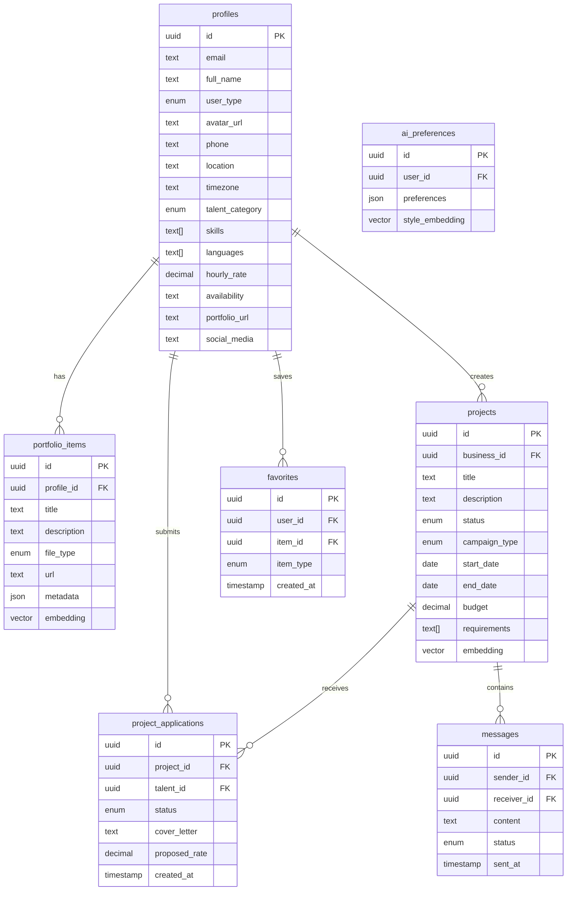

# Diagrama de Base de Datos

## Estructura General

### Versión ASCII (Vista Rápida)

```
+-------------+     +-----------------+     +------------------+
|   PROFILES  |     |    PROJECTS    |     | PORTFOLIO_ITEMS  |
+-------------+     +-----------------+     +------------------+
| id         |<--+  | id             |     | id              |
| email      |   |  | business_id    |<----| profile_id      |
| user_type  |   |  | title          |     | title           |
| skills[]   |   |  | status         |     | file_type       |
+-------------+   |  | requirements[] |     | metadata        |
       ^          |  +-----------------+    +------------------+
       |          |         ^
       |          |         |
       |          |  +-----------------+    +------------------+
       |          |  |   PROJECT      |    |    MESSAGES     |
       +----------+--| APPLICATIONS   |    +------------------+
                    +-----------------+    | sender_id       |
                    | project_id     |    | receiver_id     |
                    | talent_id      |    | content         |
                    | status         |    | status          |
                    +-----------------+    +------------------+
```

### Diagrama Detallado (Mermaid)



## Descripción de las Tablas

### Profiles

Almacena la información de usuarios, tanto talentos como empresas.

- Extiende la tabla auth.users de Supabase
- Incluye campos específicos para cada tipo de usuario
- Almacena métricas sociales para talentos

### Projects

Proyectos o campañas creadas por empresas.

- Estados posibles: draft, active, paused, completed, cancelled
- Incluye embeddings para búsqueda semántica
- Gestión de presupuesto y requisitos

### Portfolio Items

Elementos del portafolio de los talentos.

- Soporta múltiples tipos de archivos (imagen, video, etc.)
- Metadata para información adicional
- Embeddings para búsqueda y categorización

### Project Applications

Gestiona las aplicaciones de talentos a proyectos.

- Estados: pending, accepted, rejected, withdrawn
- Incluye propuesta económica
- Tracking de timestamps

### Messages

Sistema de mensajería interno.

- Estados de mensajes: sent, delivered, read
- Soporte para conversaciones 1:1
- Historial completo de comunicaciones

### Favorites

Sistema de favoritos/guardados.

- Permite guardar proyectos y perfiles
- Facilita el acceso rápido a elementos relevantes
- Tracking de fecha de guardado

### AI Preferences

Configuraciones de IA por usuario.

- Preferencias de estilo y contenido
- Embeddings para personalización
- Configuraciones de matching
